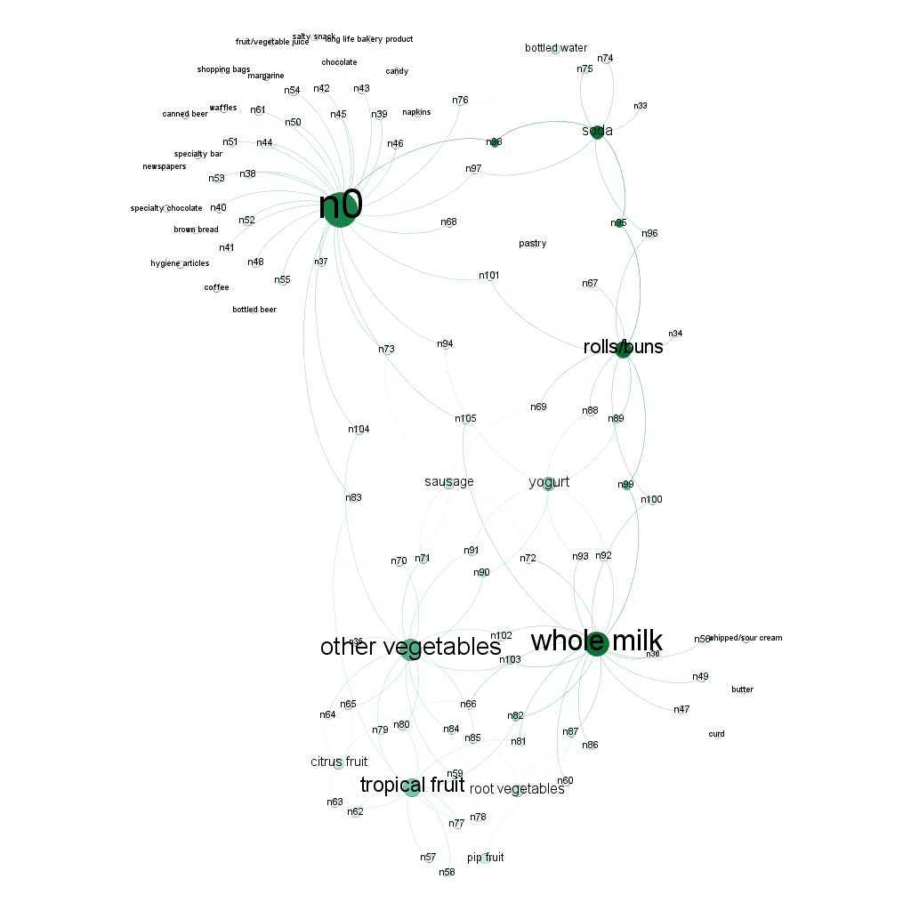

```{r setup, include=FALSE}
knitr::opts_chunk$set(echo = TRUE)
```

# Question 1: Clustering and PCA
Given the fact that the **wines.csv** dataset consists of 11 chemical properties and 6,500 different bottles of *vinho verde* wine from northern Portugal, we have some difficulty determining which dimensionality reduction technique would be the better model for the task. With only 11 variables of the chemical properties of the wine, **Principal Component Analysis (PCA)** offers a easy-to-use tool to reduce the total number of variables down to a handful to work with, however at the same time, important information might be lost if the data is reduced to just a handful. On the other hand, **clustering** offers a method where all of the variables are at play, meaning that all 11 variables would be considered when determining which wine would be a part of which artificial group we are creating. However the drawback is that given the inherent randomization of cluster selection and our algorithm settings, we would have minute yet inconsistent results.

## Principal Component Analysis
```{r pca initialization, include=FALSE}
library(ISLR)
library(tidyverse)
library(ggplot2)
library(psych)
library(xtable)

wine <- read.csv("wine.csv", header = TRUE)

# Pick out the pca columns
Z = wine[,c(1:9)]
# Standardize (center/scale) the data
Z_std = scale(Z, center=TRUE, scale=TRUE)
plot(Z_std)

x_wine = as.matrix(wine[,1:11])
y_wine_quality= wine[,12]
y_wine_color= wine[,13]

# Let's try dimensionality reduction via PCA
pc_wine = prcomp(x_wine, scale=TRUE)

# pc_wine$x has the summary variables
# Regress on the first K
K = 3
scores = pc_wine$x[,1:K]
pcr1 = lm(y_wine_quality ~ scores)


```
Our first dimensionality reduction technique would be Principal Component Analysis or PCA. In this case, the goal is to find low-dimensional summaries of high-dimensional data sets. As mentioned before, given the fact that our dataset only has 11 feature variables, the determination of what is high and low is a factor here. 11 variables by itself, is a rather low number of variables in play. However given its mathematical foundations, utilizing linear algebra to determine a vector subspace of the overall data, we capture the entirety of the data when determining our principal components.

```{r summary of pca, results = 'asis',echo=FALSE}
print(xtable(summary(pcr1)),comment=FALSE)

```
With the results of our PCA regression, we find that with just three PCA components, we are able to find a model that has **residual standard error** `r summary(pcr1)[[6]]` that captures a significant portion of the observations within the data. In addition, each coefficient's p-values indicate that each are well within the confidence level needed to utilize each principal component accurately.

\pagebreak

```{r matrix plot,echo=FALSE}
# fancy plot matrix with stuff, see http://www.sthda.com/english/wiki/scatter-plot-matrices-r-base-graphs
pairs.panels(Z_std[,1:6], 
             method = "pearson", # correlation method
             hist.col = "#00AFBB",
             density = TRUE,  # show density plots
             ellipses = TRUE # show correlation ellipses
)
```
In this matrix of different plots, we take 6 from the 11 descriptor variables in the dataset and display the following:

* Bi-variate scatter plots below the diagonal
* Histograms on the diagonal
* Pearson correlation above the diagonal.

In the bi-variate scatter plots, we find a visual correlation between different variables. By utilizing PCA we can safely presume that linear combinations of similar variables would be a suitable approach in decomposing the data to a handful of variables.

While in the histograms on the diagonal, we see that once we normalize the underlying dataset, we would have a large concentration of values in the left hand side of the total range. Further supporting the notion that there is high correlation of similar wines.

Lastly, in the Pearson correlation, the rather low (relative to zero) values hints that there is little support for multicollinearity among the variables. Ultimately, PCA is one of two approaches we used to understand the data.

\pagebreak

```{r PCA Scatterplot,echo=FALSE}
# Show the model fit
par(mfrow=c(2,2))
plot(fitted(pcr1), y_wine_quality, main="Wine Quality and PC 1", ylab = "Wine Quality",xlab = "Estimated Wine Quality from PCA")
plot(seq(1,11,by=1), pc_wine$rotation[,1], main="Coefficients of PC 1", ylab = "PC 1 Effects",xlab = "PC Input Variables")
plot(seq(1,11,by=1), pc_wine$rotation[,2], main="Coefficients of PC 2", ylab = "PC 2 Effects",xlab = "PC Input Variables")
plot(seq(1,11,by=1), pc_wine$rotation[,3], main="Coefficients of PC 3", ylab = "PC 3 Effects",xlab = "PC Input Variables")
```
Before we move to our other approach, clustering, we present a 2x2 graph depicting the relationship of each PCA component among another. Given the scattered distribution of points, we find that there is considerable difficulty discerning the quality of wine based on the betas derived from each principal component.

\pagebreak

## Clustering
```{r clustering initilization,include=FALSE}
library(ggplot2)
library(LICORS)  # for kmeans++
library(foreach)
library(mosaic)
library(gridExtra)
library(grid)

# Center and scale the data
X = wine[,c(1:9)]
X = scale(X, center=TRUE, scale=TRUE)

# Extract the centers and scales from the rescaled data (which are named attributes)
mu = attr(X,"scaled:center")
sigma = attr(X,"scaled:scale")

# Run k-means with 2 clusters and 25 starts
clust1 = kmeans(X, 2, nstart=25)

# Using kmeans++ initialization
clust2 = kmeanspp(X, k=2, nstart=25)
```

Our second method would be to apply a clustering algorithm on the data. Here we will apply a supervised learning algorithm to determine which wine type and quality level each of the wines in our dataset would be. Given our rather small categorical classifications: **red** or **white** this approach would be accurate enough to correctly classify the majority of the wines in question. Given our linear scale, be able to predict the wine quality within a close parameter of the underlying wine judged quality level. With only two clusters to predict, we have an easier time implementing the code to achieve better results.

```{r What are the clusters?, echo=FALSE}
# What are the clusters?
print("Cluster 1")
clust2$center[1,]*sigma + mu
print("Cluster 2")
clust2$center[2,]*sigma + mu
```
Here we have the criteria that the algorithm devised to determine which wine would be assigned to which cluster category. We see that given two clusters to work with, either one presumably to determine whether or not it is white or red wine, we can see distinct differences in all of the cutoff levels for each variable. 

\pagebreak

```{r Volatile and Fixed Acidity by Wine Type, echo=FALSE}
qplot(fixed.acidity, volatile.acidity, data=wine, color=factor(clust2$cluster),main = "Volatile and Fixed Acidity by Wine Type")+
  labs(colour = "Wine Type")
```
By comparing our two variable relating to acidity **Volatile Acidity** and **Fixed Acidity** we find that the clustering algorithm has captured the two main groups of wine with an intermixed amount near the middle  diagonal. As we depict more comparisons, we will find that the cluster approach produces an easier to understand graph of the results.


\pagebreak

```{r Citric Acid and Residual Sugar by Wine Type by Wine Type, echo=FALSE}
qplot(citric.acid, residual.sugar, data=wine, color=factor(clust2$cluster),main = "Citric Acid and Residual Sugar by Wine Type by Wine Type")+
  labs(colour = "Wine Type")
```
Here is an example where clustering failed to adequately determine the correct wine type based on the **Residual Sugar** and **Citric Acid** samples of the wine. With **Red** as *1* and **White** wines tagged as *2*, we find that the clustering method incorrectly created a large centroid of wines near the center of the mass.

\pagebreak

```{r Wine Qualiy and Color by actual Wine Type, echo=FALSE}
qplot(quality, color, data=wine, color=factor(clust2$cluster),main = "Wine Qualiy and Color by actual Wine Type")+
  labs(colour = "Wine Type")
```
Lastly we have the final clustering of the wine **Color** and **Quality**. The clustering approach correctly labels all but one of the white wines while missing all but two of the reds. Given the fact that there are only colors of wines to work with, missing even one or two of the wine set would mean that although a cluster approach would be easier to implement, it will still miss 10% or more of the time when determining whether or not a wine is red or white. 

\pagebreak

# Question 2: Market Segmentation

Our objective is to help NutrientH2O understand its social-media audience a little better, so it could work on targeting its market segment more aptly. We start off the same way we start any data analysis, cleaning up the data first. We try our best to clear out out the bots that might have slipped through the initial filtering. We delete users marked as spam. We measure the amount of adult content in the user's messages and delete users that have more than a quarter of their messages flagged as adult content. After removing the unused attributes now that we have deleted users with non zero values in those attributes, we move on to centering and scaling the data. 

```{r libraries, echo=FALSE, warning=FALSE, include=FALSE}
library(foreach)
library(cluster)
library(corrplot)
library(plotly)
library(GGally)
library(HSAUR)


#36 different categories
SocialData <- read.csv("https://raw.githubusercontent.com/jgscott/ECO395M/master/data/social_marketing.csv", row.names=1)

#delete users with spam
SocialData<-SocialData[(SocialData$spam==0),]

#delete uncategorized label "chatter"
SocialData <- subset(SocialData, select = -c(chatter, uncategorized))

#add total tweets & calculate adult ratio & delete adult ratio more than 30%
SocialData <- cbind(tot_twt = rowSums(SocialData), SocialData)
SocialData <- cbind(adult_ratio = 1, SocialData)
SocialData$adult_ratio <- SocialData$adult/SocialData$tot_twt
SocialData<-SocialData[(SocialData$adult_ratio<0.3),]

#delete uncategorized label "unused attributes"
SocialData <- subset(SocialData, select = -c(adult_ratio, tot_twt, spam))

# Center/scale the data
SocialData_scaled <- scale(SocialData, center=TRUE, scale=TRUE) 
```

We first use K-means clustering to measure the SSE error and check the various values of SSE error for different values of K.

```{r SSE, echo=FALSE, warning=FALSE}
#K-grid to find the optimal K
k_grid = seq(2, 20, by=1)
SSE_grid = foreach(k = k_grid, .combine='c') %do% {
  cluster_k = kmeans(SocialData_scaled, k, nstart=50)
  cluster_k$tot.withinss
}
plot(k_grid, SSE_grid, xlab="K",ylab="SSE Grid", sub="SSE Grid vs K")
```

Next we use K-means clustering again, but this time we measure the CH grid values for their respective K values.

```{r CH, echo=FALSE, warning=FALSE}
#CH-grid to find the optimal K
N=nrow(SocialData)
CH_grid = foreach(k = k_grid, .combine='c') %do% {
  cluster_k = kmeans(SocialData_scaled, k, nstart=20)
  W = cluster_k$tot.withinss
  B = cluster_k$betweenss
  CH = (B/W)*((N-k)/(k-1))
  CH
}
plot(k_grid, CH_grid, xlab="K",
     ylab="CH Grid",
     sub="CH Grid vs K")
```

Next, we use the cluster gap function to see where the dip in cluster gap is.

```{r CG, echo=FALSE, warning=FALSE}
#Gap statistics
Market_gap = clusGap(SocialData_scaled, FUN = kmeans, nstart = 20, K.max = 10, B = 10)
plot(Market_gap)
```

From the above plots, we chose K=6 intuitively as the optimum K value. There is a slight dip in the CH Grid Vs K graph at K=6. However, there is no clear dip in Cluster gaop at all showing this isn't a convex cluster.  

To analyse the K-means clustering, let's first take a look into the correlation between these various post indicators/factors.

```{r COR, echo=FALSE, warning=FALSE}
#correlation and visualization
corr <- cor(SocialData_scaled)
corrplot(corr, method="color", type="upper", tl.cex = 0.5, tl.col="black", order="hclust")
```

From the above graph, we pick the factors that have highest correlation with each other and try to analyze the K-means clustering results of these factors.

i) Personal fitness, Health, Outdoors
```{r D1, echo=FALSE, warning=FALSE}
# k-means analysis
clust1 = kmeans(SocialData_scaled, centers=6, nstart=25)
D1 = subset(SocialData,select = c("personal_fitness","health_nutrition","outdoors"))
ggpairs(D1, aes(col = factor(clust1$cluster), alpha=0.5), columns = 1:ncol(D1), title = "Clusters on personal fitness, health and outdoors",
        upper = list(continuous = "cor", combo = "box_no_facet", discrete = "facetbar", na = "na"), 
        lower = list(continuous = "points", combo = "facethist", discrete = "facetbar", na = "na"), 
        diag = list(continuous =  "densityDiag", discrete = "barDiag", na = "naDiag"), params = NULL,
        xlab = NULL, ylab = NULL, axisLabels = c("show"),
        labeller = "label_value",
        switch = NULL, showStrips = NULL, legend = NULL,
        cardinality_threshold = 15, progress = NULL)
```

ii) Fashion, Cooking, Beauty, Shopping, Photo sharing

```{r D2, echo=FALSE, warning=FALSE}
D2 = subset(SocialData,select = c("fashion","cooking","beauty", "shopping", "photo_sharing"))
ggpairs(D2, aes(col = factor(clust1$cluster), alpha=0.5), columns = 1:ncol(D1), title = "Clusters on fashion, cooking, beauty, shopping and photosharing",
        upper = list(continuous = "cor", combo = "box_no_facet", discrete = "facetbar", na = "na"), 
        lower = list(continuous = "points", combo = "facethist", discrete = "facetbar", na = "na"), 
        diag = list(continuous =  "densityDiag", discrete = "barDiag", na = "naDiag"), params = NULL,
        xlab = NULL, ylab = NULL, axisLabels = c("show"),
        labeller = "label_value",
        switch = NULL, showStrips = NULL, legend = NULL,
        cardinality_threshold = 15, progress = NULL)
```

iii) Gaming, College, Sports
```{r D3, echo=FALSE, warning=FALSE}
D3 = subset(SocialData,select = c("online_gaming","college_uni","sports_playing"))
ggpairs(D3, aes(col = factor(clust1$cluster), alpha=0.5), columns = 1:ncol(D1), title = "Clusters on gaming, university and sports",
        upper = list(continuous = "cor", combo = "box_no_facet", discrete = "facetbar", na = "na"), 
        lower = list(continuous = "points", combo = "facethist", discrete = "facetbar", na = "na"), 
        diag = list(continuous =  "densityDiag", discrete = "barDiag", na = "naDiag"), params = NULL,
        xlab = NULL, ylab = NULL, axisLabels = c("show"),
        labeller = "label_value",
        switch = NULL, showStrips = NULL, legend = NULL,
        cardinality_threshold = 15, progress = NULL)
```

iv) Sports fan, Parenting, School, Food, Family
```{r D4, echo=FALSE, warning=FALSE}
D4 = subset(SocialData,select = c("sports_fandom","parenting","school","food", "family"))
ggpairs(D4, aes(col = factor(clust1$cluster), alpha=0.5), columns = 1:ncol(D1), title = "Clusters on sports, parenting, school, food, family",
        upper = list(continuous = "cor", combo = "box_no_facet", discrete = "facetbar", na = "na"), 
        lower = list(continuous = "points", combo = "facethist", discrete = "facetbar", na = "na"), 
        diag = list(continuous =  "densityDiag", discrete = "barDiag", na = "naDiag"), params = NULL,
        xlab = NULL, ylab = NULL, axisLabels = c("show"),
        labeller = "label_value",
        switch = NULL, showStrips = NULL, legend = NULL,
        cardinality_threshold = 15, progress = NULL)
```


v) Politics, News, Computers, Travel, Automotive
```{r D5, echo=FALSE, warning=FALSE}
D5 = subset(SocialData,select = c("politics","news","computers", "travel", "automotive"))
ggpairs(D5, aes(col = factor(clust1$cluster), alpha=0.5), columns = 1:ncol(D1), title = "Clusters on politics, news, computers, travel, automotive",
        upper = list(continuous = "cor", combo = "box_no_facet", discrete = "facetbar", na = "na"), 
        lower = list(continuous = "points", combo = "facethist", discrete = "facetbar", na = "na"), 
        diag = list(continuous =  "densityDiag", discrete = "barDiag", na = "naDiag"), params = NULL,
        xlab = NULL, ylab = NULL, axisLabels = c("show"),
        labeller = "label_value",
        switch = NULL, showStrips = NULL, legend = NULL,
        cardinality_threshold = 15, progress = NULL)
```

vi) TV, Art, Music
```{r D6, echo=FALSE, warning=FALSE}
D6 = subset(SocialData,select = c("tv_film","art","music"))
ggpairs(D6, aes(col = factor(clust1$cluster), alpha=0.5), columns = 1:ncol(D1), title = "Clusters on tv, art, music",
        upper = list(continuous = "cor", combo = "box_no_facet", discrete = "facetbar", na = "na"), 
        lower = list(continuous = "points", combo = "facethist", discrete = "facetbar", na = "na"), 
        diag = list(continuous =  "densityDiag", discrete = "barDiag", na = "naDiag"), params = NULL,
        xlab = NULL, ylab = NULL, axisLabels = c("show"),
        labeller = "label_value",
        switch = NULL, showStrips = NULL, legend = NULL,
        cardinality_threshold = 15, progress = NULL)
```

From the above graphs, we can see that there isn't much we can try to extract in terms of segments from the above data. Very few factors are highly explained by other factors. Hence, we decided to do the PCA analysis to extract them into different market segments so that we can see what are the factors explaining the most amount of the variance in their messages. As we have done multiple edits to the original dataset, we again extract the original dataset from the website and clean it up again using the same criterion as before. 

```{r PCA, echo=FALSE, warning=FALSE, include=FALSE}
SocialMarket <- read.csv("https://raw.githubusercontent.com/jgscott/ECO395M/master/data/social_marketing.csv", row.names=1)

#delete users with spam
SocialMarket<-SocialMarket[(SocialMarket$spam==0),]

#delete uncategorized label "chatter"
SocialMarket <- subset(SocialMarket, select = -c(chatter, uncategorized))

#add total tweets & calculate adult ratio & delete adult ratio more than 30%
SocialMarket <- cbind(tot_twt = rowSums(SocialMarket), SocialMarket)
SocialMarket <- cbind(adult_ratio = 1, SocialMarket)
SocialMarket$adult_ratio <- SocialMarket$adult/SocialMarket$tot_twt
SocialMarket<-SocialMarket[(SocialMarket$adult_ratio<0.3),]

#delete uncategorized label "unused attributes"
SocialMarket <- subset(SocialMarket, select = -c(adult_ratio, tot_twt, spam))

#center and scale the data
SocialMarket = scale(SocialMarket, center=TRUE, scale=TRUE)

# correlation
corr=cor(SocialMarket)

# PCA
pca = prcomp(SocialMarket,scale=TRUE)
loadings = pca$rotation
scores = pca$x

# PVE
V = pca$sdev^2
PVE = V / sum(V)
round(PVE, 2)
```

After doing the PCA analysis of the data and calculating both variance and the proportion of variance explained by these low dimensional summaries, we plot the Scree plot and the cumulative scree plot to get an idea on the different segments explaining these differences. 

```{r Scree Plot, echo=FALSE, warning=FALSE}
Plot1 = qplot(c(1:33), PVE) + 
  geom_line() + 
  xlab("Principal Component") + 
  ylab("PVE") +
  ggtitle("Scree Plot") +
  ylim(0, 0.15)
Plot1
```

```{r CSP, echo=FALSE, warning=FALSE}
Plot2 = qplot(c(1:33), cumsum(PVE)) + 
  geom_line() + 
  xlab("Principal Component") + 
  ylab(NULL) +
  ggtitle("Cumulative Scree Plot") +
  ylim(0,1)
Plot2
```

From the above graphs, we can see that almost 50% of the variance is explained by the 6 out of 33 factors. Hence, this reaffirms our intiial value of K as well. We get the following market segments that NutrientH2O can use to segment its audience and target them with sharper messages.

```{r ES, echo=FALSE, warning=FALSE, include=FALSE}
# extract market segments
o1 = order(loadings[,1], decreasing=TRUE)
colnames(SocialMarket)[head(o1,5)]
o2 = order(loadings[,2], decreasing=TRUE)
colnames(SocialMarket)[head(o2,5)]
o3 = order(loadings[,3], decreasing=TRUE)
colnames(SocialMarket)[head(o3,5)]
o4 = order(loadings[,4], decreasing=TRUE)
colnames(SocialMarket)[head(o4,5)]
o5 = order(loadings[,5], decreasing=TRUE)
colnames(SocialMarket)[head(o5,5)]
o6 = order(loadings[,6], decreasing=TRUE)
colnames(SocialMarket)[head(o6,5)]
o7 = order(loadings[,7], decreasing=TRUE)
colnames(SocialMarket)[head(o7,5)]
```

The first market segment is parents with children who go to school, are religious, have interest in food and are sports fans. These are your average parents who can be targeted better by advertising the product as a sports drink for their kids. The second market segment is the exact same as the first. Hence, we remove the repetition. The third market segment is people into politics, travel, computers, news and automotive. These are your typical white collar employees who can be targeted better by advertising the drink as a health drink. The fourth segment is people who are heavily into health, fitness, outdoors, politics and news. These are your regular outdoorsy health conscious people who coud be of any age or any employment. They can again be targeted better by advertising NutrientH2O as a health drink. The fifth segment is people who post about beauty, fashion, cooking, photosharing and shopping. This segment would easily represent both college students as well as married women. They can be targeted better by offering better prices and packaging. The sixth segment is people who post about gaming, playing sports, their colleges, automotives and cooking. This is a very typical yet accurate description of most college students. They can targeted better by advertising the drink as a sports drink and offering better prices as this is a highly price sensitive group. The seventh segment is people who post about automotives, shopping, photo sharing, news and current events. This seems to be quite a generic group combining different kinds of interests. Hence, removing the repeated segment, we get a total of six different market segments as mentioned above that can be targeted better and advertised to in different ways.

\pagebreak

# Question 3: Association Rules for Grocery Purchases
```{r question 3 initialization,include=FALSE}
library(tidyverse)
library(arules)  # has a big ecosystem of packages built around it
library(arulesViz)
library(data.table)

# Association rule mining

groceries_raw <- read.csv("groceries.txt", header=FALSE)
setDT(groceries_raw, keep.rownames = "id")[]
names(groceries_raw) <- c("id","item1","item2","item3","item4")
groceries <- gather(groceries_raw,order,item,item1:item4,factor_key = TRUE)

basket = split(x=groceries$item, f=groceries$id)
basket = lapply(basket, unique)
basket.trans = as(basket, "transactions")

basket.rules = apriori(basket.trans, parameter=list(support=.001, confidence=.01, maxlen=4))

sub2 = subset(basket.rules, subset=confidence > 0.1 & support > 0.01)
```
The problem of any grocery marketer is what items to stock and in what quantities. If there are certain groups of products, like peanut butter and jelly with bread, then it would make sense to stock items of group value. Market basket analysis has the purpose of quantifying items within the shelves in a store. Placing products is more of an art than a science - however it doesn't mean data analysis should not be a major component in its creation. The goal is to influence customer purchasing habits to chain-buy their groceries. With this in mind, we will delve into the data set at hand.
```{r groceries list,echo=FALSE}
groceries_raw$item1 %>%
  summary(maxsum=Inf) %>%
  sort(decreasing=TRUE) %>%
  head(20) %>%
  barplot(las=2, cex.names=0.6)
```
Here is a list of the top items within the data set. It is clear that the most popular item is milk. Being the mainstay of various food groups, milk and cereal, milk and baking, milk in . 
```{r plotting,include=FALSE}
par(mfrow=c(3,1)) 
plot(basket.rules)
plot(basket.rules, measure = c("support", "lift"), shading = "confidence")
plot(basket.rules, method='two-key plot')
```
With only 2160 rules created, this is a good start in understanding the associations of different goods within the data set. But the holy grail is to visualize the data using a network graph.
```{r gephi, echo=FALSE, fig.cap="Market Basket Association Network", out.width = '100%'}

```
